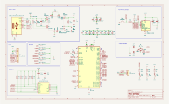
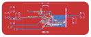
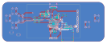
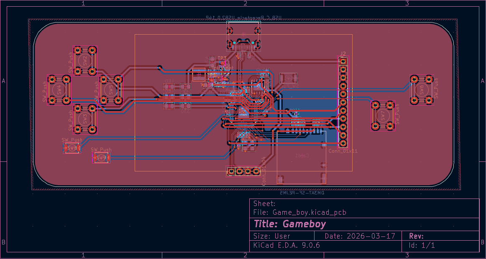
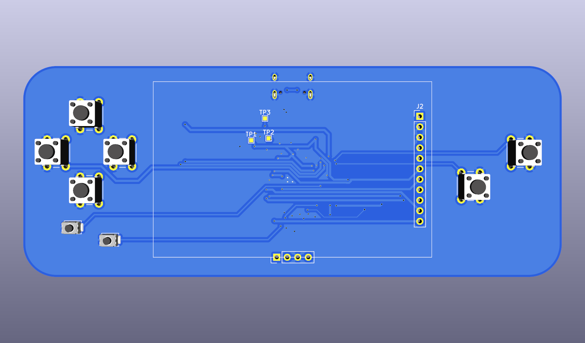
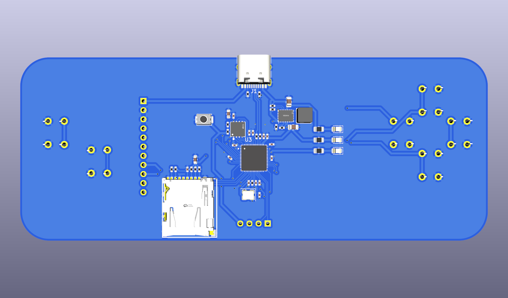

# Pico Gameboy
I came across with this DIY Gameboy video made of Raspberry Pi Pico and inspired me to build my own version. The fact that RP2040 has dual-core ARM Cortex-M0+ processor makes it capable of running some light emulators. So I’ll build a little handheld game console using RP2040 that can run gameboy!

https://github.com/user-attachments/assets/909a369a-9677-4903-9628-0e65bedbe7ed
https://github.com/user-attachments/assets/1b85eab4-04bd-4f8f-a2d0-78ee750a4273

# Features
- Full-on Gameboy experience: Actually runs the classics smoothly without freaking out.
- Insanely portable: Squeezed everything into a super compact custom PCB so you can just chuck it in your pocket.
- 100% Custom Hardware: Fully designed, routed, and reflowed by yours truly (my eyes are still bleeding from staring at KiCad traces bruh).

# Components
- RP2040
- 12MHz Crystal (ABM8-272-T3)
- 8MB Flash Storage (W25Q64JVXGIQ)
- Buck-Boost Switching Regulator (RT6150B)
- USB-C (TYPE-C-31-M-12)

# PCB Designs
- 2 layers
- Single-sided component placement
- 2.6mm board thickness
- HASL (with lead) surface finish
- 1oz outer copper weight

## PCB Schematic

## PCB Layouts

## 3D Model

# How to order
- Download the zip file
- Upload the zip file to JLCPCB
- Select PCBA and continue
- Upload BOM.csv and position.csv
- Select the parts and submit payment
